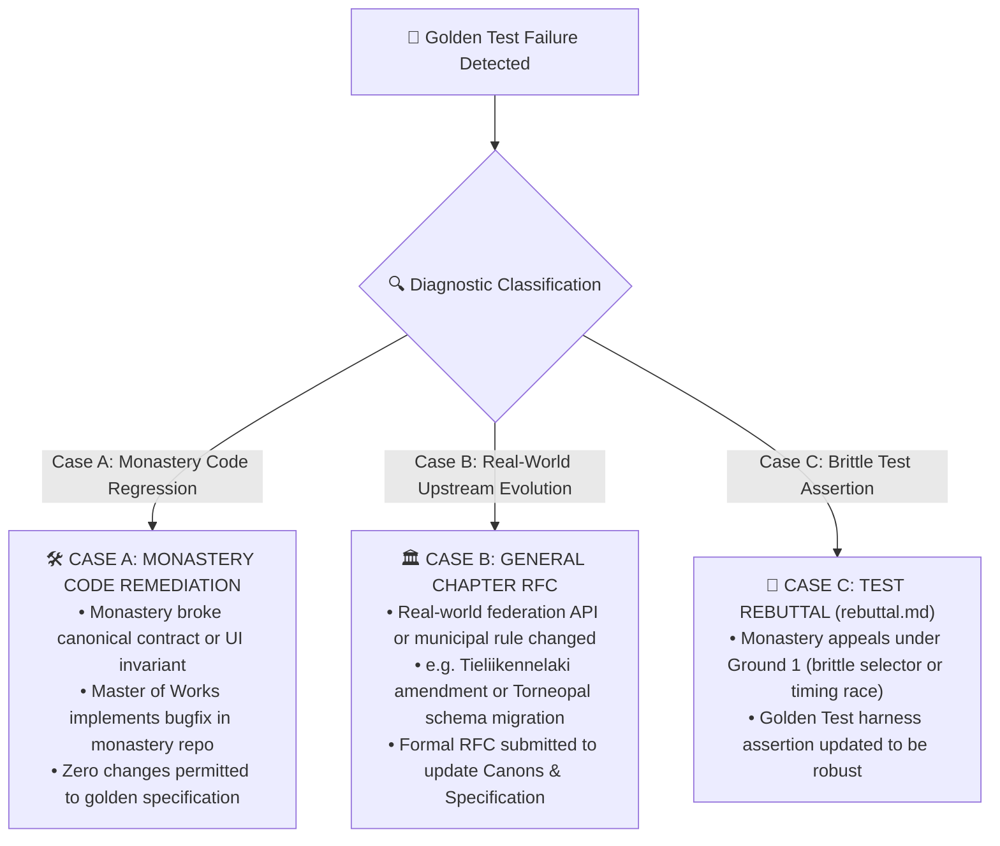

# 🏛️ Real-User Golden Test Specification: Monastic Youth Sports Federation
**Version:** 2.0.0  
**Status:** Canonical Black-Box Test Architecture Standard  
**Target Monasteries:** Pelipäivä, ParkkiS, Football Stats, Floorball Stats, Basketball Stats, Volleyball Stats  
**Governance Standard:** Monastic Congregation Canons (`contracts/index.ts` v1.0.0)  

---

## 1. Executive Summary & Philosophy of Black-Box Verification

### 1.1 The Gray-Box Import Fallacy
In early iterations of federation governance, the master verification suite (`scripts/supreme-golden-test.mjs`) relied heavily on direct in-memory TypeScript module imports:

```javascript
// The Gray-Box Anti-Pattern in scripts/supreme-golden-test.mjs:26-41
import { extractTeamIdFromUrl, normalizeUrlString } from '../pelipaiva/src/lib/api/associationUrlParser.ts'
import { detectFamilyConflicts } from '../pelipaiva/src/lib/events/familyConflictEngine.ts'
import { calculateParkingRiskContract } from '../pelipaiva/src/types/contracts.ts'
import { SportRulesRegistry } from '../pelipaiva/src/lib/stats/SportRulesRegistry.ts'
import { generateJoinWhatsApp, generateRosterDeltaWhatsApp } from '../pelipaiva/src/lib/sync/familyWhatsApp.ts'
```

While executing these isolated algorithms validates unit-level arithmetic in a Node.js process, it suffers from the **Gray-Box Import Fallacy**:
1. **Bypasses the Browser Runtime Environment:** Pure TypeScript imports execute in a synthetic V8 harness without a DOM tree, CSS layout engine, rendering pipeline, or accessibility tree.
2. **Ignores Component Lifecycle & Re-render Cascades:** It fails to detect when React 19 component trees crash on render, swallow state updates, or trigger infinite re-render loops. A function may return valid conflict data, but if `FamilyVisualCalendar.tsx` or `ConflictWarningBadge.tsx` fails to bind props or crashes with `TypeError: Cannot read properties of undefined`, the user experiences a blank screen or a silent UI freeze.
3. **Obscures Storage & Indexing Failures:** Real users persist state across browser sessions via Dexie.js (IndexedDB). In-memory unit executions bypass native IndexedDB transaction lifecycles, upgrade events, compound index queries (`[profileId+startTime]`), and quota persistence limits (`navigator.storage.persist()`).
4. **Masks Styling & Touch Target Deficiencies:** A unit test cannot assert whether an interactive badge meets the WCAG 2.2 AA touch target requirement of `min-h-[44px]` on mobile screens (`Mobile Chrome iPhone 15` / `Pixel 7`), or if text overflows critical game times.
5. **Generates False Confidence:** Unit-level code imports frequently pass 100% in CI pipelines while production deployments break for actual parents and coaches standing pitch-side in rainy Helsinki mornings.

**Canonical Rule:** A real-user golden test must treat the entire ecosystem as an untrusted, black-box black box. It must interact with applications exclusively through observable user surfaces: DOM inputs, keyboard navigation, pointer gestures, clipboard contents, URL state, and standard browser storage queries.

---

### 1.2 The 5-Point Test Dimension Standard
Every test scenario in this specification adheres strictly to the canonical 5-point test standard defined in `docs/plans/TEST_PLAN_STANDARD.md`:

```
┌─────────────────────────────────────────────────────────────────────────────┐
│                      THE 5-POINT TEST SPECIFICATION                         │
├─────────────────────────────────────────────────────────────────────────────┤
│ 1. 👤 USER JOURNEY        The human story: who does what, when, and where.   │
│ 2. 🎯 REASON IT EXISTS    The concrete pain point, risk, or job-to-be-done. │
│ 3. 🧪 WHAT IT TESTS       The exact contracts, APIs, schemas, and UI state. │
│ 4. 🟢 WHEN IT SUCCEEDS    The clear, unambiguous pass condition.            │
│ 5. 🔴 WHEN IT SHOULD FAIL The exact anomalies, errors, and drift triggers.  │
└─────────────────────────────────────────────────────────────────────────────┘
```

---

### 1.3 Zero-Mock Policy: Authentic Browser Execution
Golden runs strictly prohibit synthetic mock generators (such as `pelipaiva/src/lib/testing/syntheticMockFactory.ts`). Synthetic mocks insulate the test suite from real-world schema drift, upstream Torneopal API breaking changes, and genuine calendar syntax variations.

Under the **Zero-Mock Policy**:
- **Authentic Input Fixtures:** All tests run against genuine association URLs (Palloliitto, SSBL, Basket.fi, Torneopal), authentic `.ics` calendar files exported from MyClub and Nimenhuuto, and actual coordinates of Finnish sports arenas.
- **Deterministic Network Interception (HAR / VCR Replay):** In hermetic CI environments where outbound federation network calls are restricted or rate-limited, requests are intercepted at the Playwright browser network layer (`page.route()`). Payloads are replayed verbatim from byte-level recordings of real HTTP transactions. Zero client application code is modified or mocked.
- **True Browser Engine:** Verification runs in headless Chromium instances simulating real desktop and mobile viewports with full Web Workers, WebAssembly (DuckDB-Wasm in ParkkiS), and native IndexedDB storage.

---

## 2. Monastic Federation Ecosystem & Cross-Repo Architecture

The Monastic Youth Sports Federation comprises six sovereign web applications ("monasteries") unified by canonical shared contracts:

```
┌─────────────────────────────────────────────────────────────────────────────┐
│                             PELIPÄIVÄ (Core Hub)                            │
│                 https://pelipaiva.pages.dev · React 19 / Dexie v2           │
│    • Deterministic Agent Graph      • Multi-Sport Stats Aggregator          │
│    • Fuzzy Reconciliation Engine    • WhatsApp 1-Tap Briefing Generator     │
└──────────────┬──────────────────────────────┬───────────────────────────────┘
               │                              │
      Embedded │ Slide-Over          Embedded │ Slide-Over
       Drawers │ & Deep-Links         Drawers │ & Deep-Links
               ▼                              ▼
┌──────────────────────────────┐ ┌────────────────────────────────────────────┐
│      PARKKIS (Spatial)       │ │          SPORT STATS SATELLITES            │
│  https://parkkis.pages.dev   │ │  • Football:   https://football-stats...   │
│ • DuckDB-Wasm & MapLibre GL  │ │  • Floorball:  https://floorball-stats...  │
│ • 165k+ Violation Records    │ │  • Basketball: https://basketball-stats... │
│ • Tieliikennelaki § 40 Calc  │ │  • Volleyball: https://volleyball-stats... │
└──────────────────────────────┘ └────────────────────────────────────────────┘
               │                              │
               └───────────────┬──────────────┘
                               ▼
┌─────────────────────────────────────────────────────────────────────────────┐
│                        CANONICAL CONTRACTS (v1.0.0)                         │
│                           c:\compdev\contracts                              │
│   MatchdayContextContract │ ParkingRiskContract │ SportStatsContract       │
│                     CrossRepoQueryContract                                  │
└─────────────────────────────────────────────────────────────────────────────┘
```

### 2.1 The 6 Sovereign Monasteries

1. **Pelipäivä (`pelipaiva`)**: The central matchday hub PWA. Ingests calendar feeds and association URLs, executes family schedule conflict analysis, reconciles coach gathering times with official kickoffs, and generates post-match parent briefings.
2. **ParkkiS (`Parkkis`)**: The spatial parking intelligence monastery. Powered by DuckDB-Wasm and MapLibre GL ("Night Captain" OLED theme), querying 165,700+ geocoded City of Helsinki parking tickets, Digiroad traffic sign WFS feeds, and Parkkihubi APIs to classify parking risks and compute Tieliikennelaki disc arrival times.
3. **Football Stats (`football-stats`)**: The Palloliitto (SPL) monastery. Interfaces with Torneopal SPL Taso REST APIs, handles 2-half scoring (`fs >= hts`), calculates live match minute clocks, and evaluates SPL regional eligibility date gates (31.5. / 2.9.) and downward mobility quotas.
4. **Floorball Stats (`floorball-stats`)**: The Salibandyliitto (SSBL) monastery. Processes 3-period scoring, goal/assist production tracking (G+A), penalty reason codes (`ETA`, `KOR`, `EST`, `VAP`, `TYO`), sudden-death overtime, and goalkeeper save percentages guarded against division by zero.
5. **Basketball Stats (`basketball-stats`)**: The Basket.fi monastery. Manages 4-quarter scoring, mandatory overtime periods (`hasDraws: false`), individual scoring tallies (1p/2p/3p), and quarter-level team foul bonus triggers (>= 5 fouls).
6. **Volleyball Stats (`volleyball-stats`)**: The Lentopalloliitto monastery. Implements best-of-5 rally-point sets, the mandatory 2-point deuce lead rule (no point cap), 15-point deciding 5th sets, and asymmetric 3-2-1-0 standings points.

---

### 2.2 Canonical Shared Contracts (`contracts/index.ts` v1.0.0)

All cross-monastery data exchange is governed by `contracts/index.ts`. Version 1.0.0 enforces strict Semantic Versioning invariants:
- **Rule 1 (Immutability):** Existing fields, keys, and primitive types cannot be deleted or mutated in v1.x.
- **Rule 2 (Optional Extensions):** Any new fields introduced in minor or patch releases MUST be declared optional (`?`).
- **Rule 3 (Verification):** All monasteries must satisfy `node contracts/verify-contracts.mjs` before deployment.

#### Key Contract Definitions

```typescript
export const CONTRACT_VERSION = '1.0.0' as const;
export type SupportedSport = 'football' | 'volleyball' | 'floorball' | 'basketball' | 'other';

export interface MatchdayContextContract {
  eventId: string;
  sport: SupportedSport;
  startTime: string;            // ISO 8601 UTC
  warmupTime?: string;           // ISO 8601 UTC
  homeTeam: string;
  awayTeam: string;
  venueName: string;
  coordinates?: {
    latitude: number;
    longitude: number;
  };
  association?: 'palloliitto' | 'salibandy' | 'basket' | 'torneopal' | 'other';
  externalId?: string;
}

export interface ParkingRiskContract {
  venueSlug: string;
  venueName?: string;
  riskRating: number;            // Integer 1 (Safest) to 10 (Extreme Trap)
  riskRating1to10?: number;
  safetyCategory: 'safe' | 'moderate' | 'trap';
  parkingZone?: string;          // e.g., "Maksullinen Vyöhyke 1", "Kiekko 4h"
  zoneLabel?: string;
  walkDistanceMeters?: number;
  walkTimeMinutes?: number;
  deepLinkUrl: string;
  advisoryNote?: string;
  standardFineAmountEur?: number;
  updatedAt?: string;
}

export interface SportStatsContract {
  sport: SupportedSport;
  matchOrTeamId: string;
  recentForm?: string[];         // e.g., ["W", "W", "D", "L", "W"]
  standingsSummary?: {
    rank: number;
    totalTeams: number;
    points: number;
    playedMatches: number;
  };
  headToHead?: {
    wins: number;
    draws: number;
    losses: number;
    lastResult?: string;
  };
  keyMetrics?: Record<string, string | number>;
  deepLinkUrl: string;
}

export interface CrossRepoQueryContract {
  theme?: string;                // e.g. 'night-captain' | 'dark' | 'light'
  embed?: boolean;               // True when loaded inside slide-over iframe
  parentOrigin?: string;         // Calling origin for postMessage
  targetId?: string;             // Match, team, or venue identifier
}
```

---

### 2.3 Cross-Monastery Communication: Slide-Over Drawers & WebMCP

#### 2.3.1 Embedded Iframe Slide-Over Drawers
When a user in Pelipäivä taps a parking badge or head-to-head stats button, Pelipäivä opens a responsive slide-over drawer containing the target satellite:
- **URL Parameter Contract:** `https://parkkis.pages.dev/venue/${slug}?lat=${lat}&lon=${lng}&embed=true&theme=night-captain`
- **Security & Frame Ancestors:** Satellites MUST NOT configure `X-Frame-Options: DENY`. Satellites must specify modern CSP `frame-ancestors 'self' https://pelipaiva.pages.dev http://localhost:*`.
- **Theme Synchronization:** Satellites must parse `searchParams.get("theme")` and adapt their color palette to prevent blinding bright flashes inside dark-themed host environments.

#### 2.3.2 Autonomous WebMCP Tool Discovery
Every monastery exposes structured tool definitions to AI agents via `document.modelContext` adhering to the emerging WebMCP specification:
- Pelipäivä registers: `get_matchday_schedule`, `get_family_profiles`, `calculate_transit_buffer`.
- ParkkiS registers: `check_parking_risk`, `find_nearest_disc_zone`.
- Sports Satellites register: `get_team_standings`, `get_h2h_comparison`, `get_player_eligibility`.

---

## 3. Realistic Finnish Youth Sports Matchday Personas & Fixtures

### 3.1 Realistic Club Directory

| Club Identifier | Full Official Club Name | Home Municipality | Primary Sports | Squad Tiers & Colors |
| :--- | :--- | :--- | :--- | :--- |
| **PPJ** | Pallo-Pojat Juniorit ry | Helsinki (Laru/Eira/Jätkäsaari) | Football | P12–P17 (Laru, Eira, Kilpa, Haaste); *Sininen, Valkoinen, Oranssi* |
| **HJK** | Helsingin Jalkapalloklubi ry | Helsinki (Töölö/Malmi/Kannelmäki) | Football | T10–P15 (Akatemia, Sininen, Valkoinen, Keltainen); *Sininen, Valkoinen* |
| **KäPa** | Käpylän Pallo ry | Helsinki (Käpylä/Kumpula) | Football | P11–P16 (United, City, AC); *Musta, Valkoinen* |
| **Tapiolan Honka**| Tapiolan Honka ry | Espoo (Tapiola) | Basketball | U12–U19 (Edustus, Vihreä, Valkoinen); *Vihreä, Valkoinen* |
| **ToPo** | Torpan Pojat ry | Helsinki (Munkkiniemi) | Basketball | U13–U19 (Edustus, Sininen, Valkoinen); *Sininen, Valkoinen* |
| **PuHu** | PuHu Juniorit ry | Vantaa (Myyrmäki/Hämeenkylä) | Basketball | U12–U17 (Punainen, Valkoinen); *Punainen, Valkoinen* |
| **Indians** | Westend Indians ry | Espoo (Otaniemi/Tapiola) | Floorball | P12–P16 (Edustus, Keltamusta, Keltaiset, Mustat); *Keltainen, Musta* |
| **Oilers** | Esport Oilers ry | Espoo (Tapiola Urheilupuisto) | Floorball | P12–P18 (NG, Musta, Valkoinen); *Musta, Valkoinen* |
| **Puma** | Puma-Volley ry | Helsinki (Puistola/Töölö) | Volleyball | C/B/A-juniorit (Edustus, Sininen); *Sininen, Valkoinen* |

---

### 3.2 Greater Helsinki Arena Directory

| Arena Slug | Arena Name & Address | Coordinates (WGS84) | Sports Hosted | Parking Zone & Cost Model | Walk to Gate |
| :--- | :--- | :--- | :--- | :--- | :--- |
| `otahalli` | **Otahalli Espoo**<br>Luolamiehentie 7, 02150 Espoo | 60.1841, 24.8315 | Floorball, Basketball | Pysäköintikiekko 4h (Maksuton)<br>Risk: 2/10 (`safe`) | ~120m (2 min) |
| `vaiski` | **Töölön Pallokenttä (Väiski / PK 1)**<br>Urheilukatu 5, 00250 Helsinki | 60.1873, 24.9258 | Football | Maksullinen Vyöhyke 2 (klo 9–21)<br>Risk: 7/10 (`moderate`) | ~80m (1 min) |
| `kisahalli` | **Töölön kisahalli**<br>Paavo Nurmen kuja 1, 00250 Helsinki | 60.1835, 24.9272 | Basketball, Volleyball | Maksullinen Vyöhyke 2 / Asukaspysäköinti<br>Risk: 8/10 (`trap`) | ~50m (1 min) |
| `kamppi-core` | **Kamppi Keskus / Malminkatu**<br>Malminkatu 24, 00100 Helsinki | 60.1685, 24.9312 | School Gyms / Futsal | Maksullinen Vyöhyke 1 (€4/h, 80€ sakko)<br>Risk: 8/10 (`trap`) | ~200m (3 min) |
| `myyrmaki-stadion`| **Myyrmäen jalkapallostadion**<br>Raappavuorentie 2, 01600 Vantaa | 60.2625, 24.8512 | Football | Pysäköintikiekko 3h (Maksuton)<br>Risk: 3/10 (`safe`) | ~150m (2 min) |
| `honkahalli` | **Honkahalli Espoo**<br>Urheilupuistontie 2, 02200 Espoo | 60.1772, 24.7821 | Basketball | Pysäköintikiekko 3h / Maksuton<br>Risk: 3/10 (`safe`) | ~100m (1 min) |
| `kameleonten` | **Kameleonten Espoo**<br>Monikonkatu 8, 02650 Espoo | 60.2225, 24.8115 | Floorball, Athletics | Pysäköintikiekko 2h / Kiekkopakko<br>Risk: 4/10 (`moderate`) | ~80m (1 min) |
| `energia-areena` | **Energia Areena Vantaa**<br>Rajatorpantie 23, 01600 Vantaa | 60.2641, 24.8550 | Floorball, Basketball | Pysäköintikiekko 4h<br>Risk: 3/10 (`safe`) | ~140m (2 min) |

---

### 3.3 Calendar Edge Cases & Seasonal Boundary Conditions

#### 3.3.1 Saturday Multi-Sport Clusters
Active Finnish families often manage multiple children across disparate sports federations. Saturday mornings present intense logistical bottlenecks where match schedules overlap temporally across municipalities (e.g. child 1 in Espoo, child 2 in Helsinki).

#### 3.3.2 Away Jersey Rules & Color Code Disambiguation
Under Palloliitto and SSBL competition rules, when home and away squad colors clash, the **away team** must play in their alternate/away kit. 
* Example: If PPJ Laru Sininen (blue) plays away against HJK Sininen (blue), PPJ must wear their white alternate kit (`valkoinen varapaita`).
* Calendar imports frequently note: `"VJS - PPJ (Vierasottelu) - Valkoinen peliasu!"`. The engine must parse `"valk"` / `"valkoinen"` and avoid creating duplicate events.

#### 3.3.3 Daylight Saving Time (DST) Transition Boundaries
Finland observes Eastern European Time (EET, UTC+2) in winter and Eastern European Summer Time (EEST, UTC+3) in summer.
* **Spring Forward (EET ➔ EEST):** Sunday, **2026-03-29**. Clocks advance from 03:00 to 04:00 local time. A match scheduled at 10:00 local time MUST be stored as `2026-03-29T07:00:00.000Z` and render as `10:00` in the UI.
* **Autumn Fall Back (EEST ➔ EET):** Sunday, **2026-10-25**. Clocks retreat from 04:00 to 03:00 local time. A match scheduled at 10:00 local time MUST be stored as `2026-10-25T08:00:00.000Z` and render as `10:00` in the UI.
* **Failure Trigger:** Any system that naively offsets UTC by a fixed 2 or 3 hours shifts kickoffs by ±1 hour on transition days.

---

## 4. The 5 Supreme Adversarial End-User Journeys (R1)

---

### 4.1 Journey 1: Multi-Sport Family Saturday Clash (Espoo vs Helsinki)

#### 1. 👤 User Journey
The Virtanen family resides in Lauttasaari with two active youth athletes:
- **Tuomas** (13 years old): Plays floorball for **Westend Indians P14 Haastaja**. His match is scheduled at **Otahalli (Espoo)** on Saturday, `2026-09-05`, with kickoff at `10:00` and coach gathering at `09:15`. The match concludes at `11:15`.
- **Aino** (12 years old): Plays football for **HJK T13 Sininen**. Her match is scheduled at **Töölön Pallokenttä PK 1 (Helsinki)** on Saturday, `2026-09-05`, with kickoff at `10:30` and coach gathering at `09:45`. The match concludes at `11:45`.

Parent Mikko opens Pelipäivä on Saturday morning expecting clear logistical guidance. Because the matches occur simultaneously across municipal borders (Espoo vs Helsinki), a single driver cannot transport both children.

#### 2. 🎯 Reason It Exists
In Finnish youth sports, schedule clashes are the primary source of weekend family panic. If the application fails to detect travel constraints between venues, parents arrive late, children miss warmups, or families incur parking fines.

#### 3. 🧪 What It Tests
- Temporal overlap detection between two independent child profiles.
- Driving transit buffer calculations between Otahalli (`60.1841, 24.8315`) and Töölö PK 1 (`60.1873, 24.9258`).
- Prevention of the **3 Divergent Travel Formulas Defect** and **Missing Coordinate Fallback Trap**.
- Prevention of the **UTC Date Substring Boundary Bug**.

```typescript
// Architectural Flaw Analysis: 3 Divergent Travel Formulas in pelipaiva/src/lib
// 1. familyConflictEngine.ts:50 -> Math.ceil((distKm / 25) * 60 + 7)  [urban 25 km/h + 7 min parkki]
// 2. transitEngine.ts:62,146    -> Math.max(5, Math.round((rawDist * 1.25) * 1.6) + 4)
// 3. agents/time.ts:150         -> Math.min(90, Math.round(km * 2.1 + 8))

// Flaw 2: Missing Coordinates Null Return in agents/time.ts:134-146
// If an away field is un-geocoded (lat: 0, lng: 0), drive returns 0, suppressing the conflict warning entirely!

// Flaw 3: UTC Date Substring Boundary Bug in conflictAgent.ts:60
// const dateA = a.startTime.slice(0, 10);
// For events near midnight UTC, UTC date slice differs from Finnish local date!
```

#### 4. 🟢 When It Succeeds
- The UI displays a persistent, non-dismissible conflict alert (`[data-testid="family-conflict-alert"]`).
- The alert prominently renders the Finnish warning text: `"⚠️ Tarvitaan kaksi kuskia tai kimppakyyti!"`.
- The transit warning displays an estimated driving duration of **28 minutes** (7.2 km straight-line distance, ~10.8 km driving route along Länsiväylä/Porkkalankatu, calculated at 25 km/h urban speed + 7 min parking buffer).
- Both events appear correctly in the 7-day visual timeline (`[data-testid="family-visual-calendar"]`) with distinct athlete tags ("Tuomas" and "Aino").

#### 5. 🔴 When It Should Fail
- The conflict warning banner is missing from the DOM.
- The transit calculation evaluates to `0 min` (triggering false safety) or explodes to `> 500 min` (Null Island coordinate error).
- The conflict engine skips evaluation because events differ in their UTC date slice (`slice(0, 10)` bug).

---

### 4.2 Journey 2: Away Match Reconciliation & Color Code Disambiguation

#### 1. 👤 User Journey
Coach Antti exports the team schedule via MyClub `.ics` calendar feed for **PPJ Laru Sininen P12**. For the away game against **VJS Punainen**, the coach sets the calendar title as:
`"VJS - PPJ (Vierasottelu) - Valkoinen peliasu!"`  
with gathering at `12:15` on `2026-09-12` at `Myyrmäen urheilupuisto TN 1`.

Later, parent Johanna links the official Palloliitto Tulospalvelu URL. The federation lists kickoff at `13:00` on `2026-09-12` between home team **VJS Punainen** and away team **PPJ Laru Sininen**.

#### 2. 🎯 Reason It Exists
Calendar sync engines notoriously duplicate events when gathering times (45 min prior) differ from official kickoffs, or when away match titles invert team order. This clutter causes parents to lose track of actual match timings.

#### 3. 🧪 What It Tests
- **Intentional Warmup Reconciliation:** Identifying that a 45-minute offset (`12:15` arrival vs `13:00` kickoff) is an intentional warmup window (`15 <= timeDiff <= 75 min`), NOT an official schedule change.
- **Away Match Role Inversion:** Correctly detecting that PPJ is the away team (`isHome: false`) when the title is formatted as `"VJS - PPJ"`.
- **Jersey Color Disambiguation:** Parsing `"valkoinen peliasu"` / `"valk"` and recommending the white alternate kit without falling back to neutral gray `#64748b`.
- **Asynchronous Ingestion Deduplication:** Ensuring that attaching the official federation feed merges with the pre-existing calendar item rather than producing two duplicate cards.

```typescript
// Defect Analysis in pelipaiva/src/lib/reconciliation/reconciliationEngine.ts:75-89
// Defect A: isIntentionalWarmupOffset is true, BUT hasKickoffMismatch = timeDiffMinutes >= 5 is ALSO true!
// Result: mismatchFlags.timeMismatch = true triggers spurious warning: "Aikataulumuutos: 12:15 -> 13:00".

// Defect B: Away Opponent Inversion:
// calOpponent = calendarEvent.awayTeam || calendarEvent.homeTeam -> evaluates to 'PPJ'
// offOpponent = officialFixture.isHome ? officialFixture.awayTeam : officialFixture.homeTeam -> evaluates to 'VJS'
// calculateTeamSimilarity('PPJ', 'VJS') = 0.0 -> Triggers false-positive Opponent Mismatch warning!
```

#### 4. 🟢 When It Succeeds
- The DOM renders exactly **ONE** matchday card (`[data-testid="matchday-card"]`).
- Kickoff displays as `13:00` and gathering/kokoontuminen displays as `12:15`.
- The card displays the badge `"Vierasottelu"`.
- The kit indicator highlights **Valkoinen varapaita** (white jersey) with clear contrast borders.
- No false-positive warning banners (`"Aikataulumuutos"` or `"Vastustaja ei täsmää"`) are displayed.

#### 5. 🔴 When It Should Fail
- Two separate cards are rendered for the same match (duplicate card defect).
- A false-positive banner warns that kickoff moved from `12:15` to `13:00`.
- The opponent is reported as mismatched because own away team was compared against official home team.

---

### 4.3 Journey 3: Urban Parking Risk & Walking Navigation (ParkkiS)

#### 1. 👤 User Journey
On Saturday afternoon, parent Mikko drives to an away match in the Helsinki central core near **Kamppi / Töölön kisahalli** (`Paavo Nurmen kuja 1`). He opens the match card in Pelipäivä to check parking restrictions. Later in the month, he drives to **Otahalli (Espoo)** for a floorball match.

#### 2. 🎯 Reason It Exists
Helsinki central core parking enforcement issued over 165,000 fines in recent years. Parking in Zone 1 costs €4.00/h and violations incur €80 fines. In contrast, Otahalli offers 4 hours of free parking with a standard parking disc. Parents need instant, unambiguous parking guidance before departure.

#### 3. 🧪 What It Tests
- Integration with `ParkingRiskContract` across risk boundaries:
  - **Kamppi / Central Core:** High-risk parking trap (`riskRating: 8`, `safetyCategory: "trap"`, `parkingZone: "Maksullinen Vyöhyke 1"`).
  - **Otahalli Espoo:** Safe free parking (`riskRating: 2`, `safetyCategory: "safe"`, `parkingZone: "Pysäköintikiekko 4h (Maksuton)"`, walking distance `120m`).
- **Tieliikennelaki 2020 § 40 Parking Disc Rounding:** Arrival time rounding to the next half-hour or full hour:
  - Arrival at `14:05` ➔ Disc set to `14:30`.
  - Arrival at `14:35` ➔ Disc set to `15:00`.
  - Arrival exactly at `14:30` ➔ Disc set to `14:30`.
- **Slide-Over Theme Contract:** Query parameter pass-through (`theme=night-captain` vs accepted values in `Parkkis/web/src/App.tsx`).

#### 4. 🟢 When It Succeeds
- For Otahalli: DOM displays a green badge (`[data-testid="parking-ease-badge"]`) containing `"🟢 Helppo parkki"` and text `"Pysäköintikiekko 4h"`.
- For Kamppi/Kisahalli: DOM displays an amber/red badge containing `"🔴 Ahdas parkki"` or `"Valvontariski"`.
- Opening the parking modal shows the correct rounded disc arrival time under Tieliikennelaki 2020 § 40.
- Tapping the interactive map link deep-links to `https://parkkis.pages.dev/venue/...` with valid coordinate parameters.

#### 5. 🔴 When It Should Fail
- Otahalli is marked as high-risk or Kamppi is marked as safe.
- Disc calculation outputs unrounded minutes (e.g. `"14:05"` instead of `"14:30"`).
- Deep link crashes the embedded viewer due to unhandled theme parameters.

---

### 4.4 Journey 4: Cross-Sport Scoring & Standings Math

#### 1. 👤 User Journey
A sports family follows four children playing football, floorball, basketball, and volleyball. Over the weekend, parents review match results, quarter/period breakdowns, and league standings in Pelipäivä.

#### 2. 🎯 Reason It Exists
Each sport possesses radically different temporal and scoring semantics governed by its respective federation. Displaying basketball scores as "halves" or allowing draws in basketball or volleyball destroys user trust.

#### 3. 🧪 What It Tests
- **Football (Palloliitto SPL):**
  - Two halves (`Puoliaika`).
  - Score invariant: Final score must be greater than or equal to half-time score (`fs_A >= hts_A` and `fs_B >= hts_B`).
  - Standings allocation: 3 points for win, 1 point for draw, 0 for loss (`hasDraws: true`).
  - SPL regional eligibility date gates: Spring gate `31.5.` and Autumn gate `2.9.`.
- **Floorball (Salibandyliitto SSBL):**
  - Three periods (`Erä`). Final score equals `p1 + p2 + p3 (+ OT)`.
  - Standings: 2 points for win, 1 for draw, 0 for loss.
  - Player production: Points equal Goals + Assists (`G+A`).
  - Goalkeeper save percentage guard: `saves / (saves + goalsConceded) * 100`. If 0 shots faced, MUST return `"100%"` (never `NaN%`).
- **Basketball (Basket.fi):**
  - Four quarters (`Neljännes`) plus mandatory overtime (`p5+`).
  - Strict zero draws invariant: `hasDraws: false`.
  - Team foul bonus free throw trigger: Emitted when single-quarter fouls `>= 5`. Fouls reset to 0 at the start of each quarter.
- **Volleyball (Lentopalloliitto):**
  - Best-of-5 sets (Erät). Zero draws allowed.
  - Deuce rule (2-point margin): Standard sets (1–4) played to 25 points, but MUST be won by 2 points (e.g. 26–24, 28–26). No point cap. A score of `25-24` is in-progress.
  - Deciding 5th set: Played to 15 points with mandatory 2-point margin.
  - Asymmetric Standings Points: 3-0 or 3-1 win = 3 pts to winner, 0 to loser; 3-2 win = 2 pts to winner, 1 pt to loser.
  - Total Points Independence: The team with more total match points can lose the match.

#### 4. 🟢 When It Succeeds
- DOM correctly labels segments by sport: `"Puoliaika"` (Football), `"Erä"` (Floorball/Volleyball), `"Neljännes"` (Basketball).
- Period sums strictly equal final scores across all sports cards.
- Basketball cards display the `"Bonusvapaaheitto"` indicator on the 5th team foul.
- Volleyball displays set tallies (e.g. `3 - 1`) and set scores adhering to the 2-point margin.

#### 5. 🔴 When It Should Fail
- A floorball goalkeeper facing 0 shots displays `NaN%` save percentage.
- A basketball or volleyball match concludes in a draw.
- A volleyball set concludes with a 1-point margin (e.g. `25-24`).
- Score concatenation occurs (e.g. `"3" + "1"` evaluates to `"31"` instead of `4`).

---

### 4.5 Journey 5: 1-Tap Post-Match WhatsApp Briefing

#### 1. 👤 User Journey
Immediately following Aino's football match at Väiski, coach Antti opens Pelipäivä, verifies the final score (`3 - 2`), and taps *"Jaa WhatsAppiin"* (`[data-testid="share-whatsapp-btn"]`) to broadcast the post-match summary to the parent group.

#### 2. 🎯 Reason It Exists
Volunteer coaches and team managers handle communication while managing junior teams. Manual typing leads to errors, but template generators often emit embarrassing placeholder bugs or runtime null-pointer exceptions.

#### 3. 🧪 What It Tests
- String template generation and clipboard integration.
- Strict prohibition of token leaks: `undefined`, `NaN`, `null`, `[object Object]`, `[SYÖTÄ TULOS]`, `[PVM]`.
- Proper formatting of carpool departures and player names.
- Prevention of `TypeError: Cannot read properties of undefined (reading 'trim')` when optional cup or league names are omitted.

```typescript
// Vulnerability Analysis in pelipaiva/src/lib/ai/deterministicReasoner.ts:251-254
// const postMatchWhatsApp = `🔥 Pelipäivän tulos: ${event.homeTeam} - ${event.awayTeam} päättyi [SYÖTÄ TULOS]! Hieno matsi kentällä ${venue.name}. Seuraava peli: [PVM].`;
// Raw placeholders [SYÖTÄ TULOS] and [PVM] leak directly into parent communications!

// Vulnerability Analysis in pelipaiva/src/lib/sync/familyWhatsApp.ts:34-38
// export function generateRosterDeltaWhatsApp(playerName, teamName, cupOrLeagueName, rawCalendarUrl) {
//   return `... ${cupOrLeagueName.trim()}`; // Throws TypeError if cupOrLeagueName is undefined!
// }
```

#### 4. 🟢 When It Succeeds
- The system clipboard (and outbound `https://wa.me/?text=...` URI) contains a clean, professional Finnish match summary.
- The string includes valid team names, final score, goal scorers, and venue name.
- Regular expression assertion confirms zero occurrences of unparsed tokens or brackets:
  `/^((?!undefined|null|NaN|\[object Object\]|\[SYÖTÄ TULOS\]|\[PVM\]).)*$/s`.

#### 5. 🔴 When It Should Fail
- The generated text contains `undefined`, `NaN`, or `null`.
- The text retains literal bracket placeholders like `[SYÖTÄ TULOS]` or `[PVM]`.
- Clicking the share button throws an unhandled `TypeError` in the browser console.

---

## 5. Black-Box Test Harness Specification (R2)

---

### 5.1 Headless Browser Test Runner Architecture

The golden test harness executes via **Playwright Chromium** running against the production build or live preview environments. It connects as an independent external client with zero internal imports.

```
┌─────────────────────────────────────────────────────────────────────────────┐
│                    PLAYWRIGHT CHROMIUM TEST RUNNER                          │
├─────────────────────────────────────────────────────────────────────────────┤
│  Device Viewports:                                                          │
│    • Mobile Chrome: iPhone 15 emulation (393 x 852, touch: true, DPR: 3)    │
│    • Desktop Chrome: 1280 x 800 viewport                                    │
│                                                                             │
│  User Interaction Engine:                                                   │
│    • Page.fill(), Page.click(), Page.dragAndDrop(), Keyboard Navigation     │
│    • Clipboard API: context.grantPermissions(['clipboard-read'])          │
│                                                                             │
│  Network Interceptor (Zero Code Mocks):                                     │
│    • page.route('**/taso/rest/**', handler) -> Verbatim HAR replay          │
│    • Latency simulation (50ms - 200ms)                                      │
│                                                                             │
│  State & Invariant Evaluators:                                              │
│    • DOM Selector & ARIA Matchers                                           │
│    • Storage Inspector: Direct IndexedDB / Dexie transaction evaluation     │
│    • Console & Network Error Listeners (fail on unhandled exceptions)       │
└─────────────────────────────────────────────────────────────────────────────┘
```

---

### 5.2 DOM User Interaction Standards

To ensure authentic accessibility and user realism, tests must interact with elements exclusively through standard user pathways:
1. **ARIA Roles & Accessible Names:** Prefer `page.getByRole('button', { name: /Jaa WhatsAppiin/i })` and `page.getByRole('tab', { name: /Tiivis/i })`.
2. **Deterministic Data-TestIDs:** Where semantic roles are ambiguous, standard test IDs are used:
   - `[data-testid="app-version-badge"]`: App version and commit hash.
   - `[data-testid="matchday-card"]`: Primary event card container.
   - `[data-testid="family-conflict-alert"]`: Conflict alert banner.
   - `[data-testid="parking-ease-badge"]`: ParkkiS risk rating badge.
   - `[data-testid="share-whatsapp-btn"]`: 1-tap WhatsApp briefing trigger.
3. **Keyboard & Touch Emulation:** Verify that modals trap focus, ESC dismisses slide-overs, and touch targets satisfy `min-h-[44px]`.

---

### 5.3 Browser Storage Auditing (Dexie.js v2 IndexedDB)

The harness inspects persistent client storage directly via `page.evaluate()` without importing application db wrappers:

```typescript
// Black-box IndexedDB inspection snippet
const indexedDbDump = await page.evaluate(async () => {
  return new Promise((resolve, reject) => {
    const req = indexedDB.open('PelipaivaDB');
    req.onerror = () => reject(req.error);
    req.onsuccess = () => {
      const db = req.result;
      const tx = db.transaction(['events', 'profiles'], 'readonly');
      const eventsStore = tx.objectStore('events');
      const getAllReq = eventsStore.getAll();
      getAllReq.onsuccess = () => resolve(getAllReq.result);
      getAllReq.onerror = () => reject(getAllReq.error);
    };
  });
});
```

**Storage Invariants:**
- Compound index `[profileId+startTime]` must exist and resolve queries in `< 20ms`.
- Reconciled events must persist with `reconciliationStatus === 'reconciled'`.
- Storage persistence must be requested via `navigator.storage.persist()`.

---

### 5.4 Network Interception & Deterministic Replay

1. **Zero Client-Side Mock Injection:** No mock objects, mock classes, or test environment flags are injected into application code.
2. **HAR / VCR Network Replay:** Outbound queries to `spl.torneopal.net`, `salibandy-api.torneopal.net`, and `koripallo-api.torneopal.net` are intercepted by Playwright:
   ```typescript
   await page.route('https://spl.torneopal.net/taso/rest/**', async (route) => {
     const fixturePath = resolve(__dirname, '../fixtures/torneopal/spl_match_fixture.json');
     const body = readFileSync(fixturePath, 'utf8');
     await route.fulfill({
       status: 200,
       contentType: 'application/json',
       body,
       headers: { 'access-control-allow-origin': '*' },
     });
   });
   ```
3. **Failure Injections:** The harness injects simulated HTTP 429 (Rate Limit) and HTTP 500 responses to verify that the UI displays non-blocking degradation notices instead of crashing.

---

## 6. Concrete Pass/Fail Evaluation Rubrics (R2)

---

### 6.1 Observable DOM State Assertions Table

| Assertion ID | User Action / Trigger | Target DOM Selector | Expected Observable State | Hard Fail Trigger |
| :--- | :--- | :--- | :--- | :--- |
| **DOM-01** | Simultaneous games in Espoo & Helsinki loaded | `[data-testid="family-conflict-alert"]` | Visible; contains text `"kaksi kuskia"` and transit duration `~28 min` | Banner absent; transit duration `0 min` or `> 500 min` |
| **DOM-02** | ICS feed + Official feed imported for same match | `[data-testid="matchday-card"]` | Exactly **1** card rendered for the fixture; kickoff `13:00`, warmup `12:15` | **2** cards rendered for same match; duplicate card defect |
| **DOM-03** | Away match with white jersey requirement | `[data-testid="away-jersey-badge"]` | Visible; contains text `"Valkoinen peliasu"`; contrast border `#e2e8f0` | Badge absent; falls back to neutral gray `#64748b` without contrast |
| **DOM-04** | Click Otahalli match card | `[data-testid="parking-ease-badge"]` | Displays `"🟢 Helppo parkki"` and `"Kiekko 4h"`; touch target `>= 44px` | Badge marked red/amber; missing disc hours |
| **DOM-05** | Click Kamppi match card | `[data-testid="parking-ease-badge"]` | Displays `"🔴 Ahdas parkki"` or `"Valvontariski"`; shows Zone 1 | Badge marked green/safe; missing fee notice |
| **DOM-06** | Switch view to Compact (`Tiivis`) | `button[role="tab"]:has-text("Tiivis")` | View updates within 150ms; `aria-selected="true"`; compact rows rendered | Blank screen; uncaught React error boundary; switch time `> 500ms` |
| **DOM-07** | Open Ask Copilot AI Drawer | `button:has-text("Kysy Pelipäivältä")` | Slide-over drawer opens; input field receives focus | Drawer fails to open; focus trapped outside drawer |
| **DOM-08** | DST Boundary Fixture View (2026-03-29) | `[data-testid="kickoff-time"]` | Kickoff displays strictly as `10:00` | Kickoff shifted to `09:00` or `11:00` |

---

### 6.2 Semantic Integrity & Mathematical Invariants Table

| Invariant ID | Domain | Assertion Formula / Check | Pass Boundary | Hard Fail Trigger |
| :--- | :--- | :--- | :--- | :--- |
| **MATH-01** | Football | Half-time vs Final Score | `fs_A >= hts_A && fs_B >= hts_B` | Final score less than half-time score |
| **MATH-02** | Football | League Standings Points | `points === wins * 3 + draws * 1` | Incorrect points sum; draw awards 0 points |
| **MATH-03** | Floorball | Period Score Summation | `fs_A === p1_A + p2_A + p3_A (+ OT_A)` | Period sum does not equal final score |
| **MATH-04** | Floorball | Goalkeeper Save Percentage | `saves / (saves + goalsConceded) * 100` | Result is `NaN%`, `< 0%`, or `> 100%`; failure on 0 shots faced |
| **MATH-05** | Basketball | 4-Quarter Sum & Zero Draws | `fs === Q1 + Q2 + Q3 + Q4 (+ OT)` and `fs_A !== fs_B` | Quarters do not sum to total; match ends in a draw |
| **MATH-06** | Basketball | Team Foul Bonus Free Throw | `isBonusFreeThrow === (quarterFouls >= 5)` | Bonus triggered at <= 4 fouls, or missing on 5 fouls |
| **MATH-07** | Volleyball | 2-Point Deuce Margin (Sets 1–4)| `winnerScore >= 25 && (winnerScore - loserScore >= 2)` | Set finished at `25-24` or with 1-point margin |
| **MATH-08** | Volleyball | Deciding 5th Set Target | `winnerScore >= 15 && (winnerScore - loserScore >= 2)` | 5th set played to 25 points instead of 15 |
| **MATH-09** | Volleyball | Asymmetric Standings | `3-0/3-1 => (3, 0); 3-2 => (2, 1)` | Winner awarded 3 points in 3-2 match; loser gets 0 points |
| **MATH-10** | WhatsApp | Zero Token Leaks | `!/(undefined\|null\|NaN\|\[object Object\]\|\[SYÖTÄ TULOS\]\|\[PVM\])/.test(text)` | Any token leak detected in generated briefing text |

---

### 6.3 Latency & Performance SLA Thresholds

| Metric | Target Standard | Acceptable Degradation | Hard SLA Breach | Verification Method |
| :--- | :--- | :--- | :--- | :--- |
| **First Contentful Paint (FCP)** | `< 800ms` | `800ms – 1,200ms` | `> 2,000ms` | Chrome Performance API under simulated 4G |
| **Time to Interactive (TTI)** | `< 1,200ms` | `1,200ms – 1,800ms` | `> 3,000ms` | Playwright `page.waitForLoadState('networkidle')` |
| **Family Conflict Recalculation** | `< 20ms` | `20ms – 50ms` | `> 100ms` | `performance.measure` across 50 simulated events |
| **Dexie Compound Query Latency** | `< 10ms` | `10ms – 25ms` | `> 50ms` | IndexedDB range query over 1,000 items |
| **Slide-Over Drawer Open Latency** | `< 100ms` | `100ms – 200ms` | `> 400ms` | DOM transition start to paint completion |

---

### 6.4 Autonomous WebMCP Tool Discovery & Chrome CDP Security Standards

| Standard ID | Target Requirement | Evaluation Mechanism | Pass Criteria | Hard Fail Trigger |
| :--- | :--- | :--- | :--- | :--- |
| **MCP-01** | Tool Discovery Schema | Inspect `window.document.modelContext.tools` | Tools contain valid JSON schemas with typed arguments | `modelContext` undefined or missing schemas |
| **MCP-02** | Schedule Tool Execution | Invoke `get_matchday_schedule({ date: '2026-09-05' })` | Returns structured JSON matching `MatchdayContextContract[]` | Tool throws uncaught error or returns empty array |
| **MCP-03** | Parking Tool Execution | Invoke `check_parking_risk({ venueSlug: 'otahalli' })` | Returns structured JSON matching `ParkingRiskContract` | Tool returns invalid risk rating outside 1–10 |
| **SEC-01** | CSP Frame Ancestors | Inspect HTTP response headers on satellites | Header contains `frame-ancestors 'self' https://pelipaiva.pages.dev` | Header contains `X-Frame-Options: DENY` |
| **SEC-02** | Zero Token / PII Leaks | Intercept all outbound network queries | No unencrypted auth tokens or player PII in query params | JWT or secret leaked in GET query parameters |

---

## 7. Traceability Matrix, CI Pipeline & Failure Remediation Protocol (R3)

---

### 7.1 Traceability Matrix: Requirements to Verification

| Requirement ID | Feature Inventory Item (`PROJECT.md`) | Test Step / Scenario | Observable DOM Selector | Invariant & Rubric ID |
| :--- | :--- | :--- | :--- | :--- |
| **R1.1** | Feature 1: Multi-Sport Schedule Clash | Journey 1 (Virtanen Family Saturday) | `[data-testid="family-conflict-alert"]` | DOM-01, SLA Conflict Calc |
| **R1.2** | Feature 2: Warmup Reconciliation | Journey 2 (PPJ vs VJS Gathering Time) | `[data-testid="matchday-card"]` | DOM-02, Warmup Offset Rule |
| **R1.2** | Feature 3: Away Match & Jersey Colors | Journey 2 (Valkoinen Peliasu Parsing) | `[data-testid="away-jersey-badge"]` | DOM-03, Color Normalizer |
| **R1.3** | Feature 4: ParkkiS Urban Parking Risk | Journey 3 (Otahalli vs Kamppi Trap) | `[data-testid="parking-ease-badge"]` | DOM-04, DOM-05, Tieliikennelaki § 40 |
| **R1.4** | Feature 5: Football Ingestion & SPL | Journey 4 (PPJ vs KäPa Halves Scoring) | `[data-testid="football-match-view"]` | MATH-01, MATH-02, SPL Gates |
| **R1.4** | Feature 6: Floorball Ingestion & Periods | Journey 4 (Indians vs Oilers 3 Periods) | `[data-testid="floorball-match-view"]`| MATH-03, MATH-04 (0-shot guard) |
| **R1.4** | Feature 7: Basketball Quarters & Fouls | Journey 4 (Honka vs ToPo 4 Quarters) | `[data-testid="basket-quarter-view"]` | MATH-05, MATH-06 (5-foul bonus) |
| **R1.4** | Feature 8: Volleyball Sets & Deuce Rule | Journey 4 (Puma vs KaLe 5-Set Match) | `[data-testid="volleyball-set-view"]` | MATH-07, MATH-08, MATH-09 |
| **R1.5** | Feature 9: WhatsApp Briefing Zero Leaks| Journey 5 (Post-Match Briefing Share) | `[data-testid="share-whatsapp-btn"]` | MATH-10, Regex Zero Token Leaks |
| **R2.1** | Feature 10: DST Transition Boundaries | Journey 3 & Scenario 5 (March/Oct) | `[data-testid="kickoff-time"]` | DOM-08, Dynamic EEST/EET |
| **R2.2** | Feature 11: Black-Box Harness | Section 5 (Playwright Chromium) | Native DOM & Clipboard APIs | Headless Browser SLA |
| **R2.3** | Feature 12: Concrete Pass/Fail Rubrics| Section 6 (Assertions & Invariants) | Complete Rubrics Tables | DOM-01..08, MATH-01..10 |
| **R3.1** | Feature 13: Master Specification | Master Deliverable Documentation | `docs/architecture/real-user...` | Zero Source Code Changes |

---

### 7.2 Automated GitHub Actions Execution Workflow

The canonical black-box golden test suite runs in GitHub Actions on every pull request and nightly schedule. The workflow enforces zero code mocks and runs against fully built production artifacts:

```yaml
name: 🏛️ Canonical Real-User Golden Verification Suite

on:
  push:
    branches: [main]
  pull_request:
    branches: [main]
  schedule:
    - cron: '0 3 * * *' # Nightly run at 03:00 UTC

jobs:
  golden-verification:
    name: Execute Supreme Black-Box Golden Verification
    runs-on: ubuntu-latest
    timeout-minutes: 25

    steps:
      - name: Checkout Governance Repository
        uses: actions/checkout@v4

      - name: Setup Node.js Environment
        uses: actions/setup-node@v4
        with:
          node-version: 22
          cache: 'npm'

      - name: Install Monorepo Dependencies
        run: npm ci

      - name: Install Playwright Browsers & OS Dependencies
        run: npx playwright install --with-deps chromium

      - name: Verify Cross-Monastery Contracts
        run: node contracts/verify-contracts.mjs

      - name: Build Production Bundles (Hermetic Verification)
        run: |
          npm run build --prefix pelipaiva
          npm run build --prefix Parkkis/web

      - name: Start Production Preview Servers
        run: |
          npx vite preview --prefix pelipaiva --port 3000 &
          npx vite preview --prefix Parkkis/web --port 3001 &
          npx wait-on http://localhost:3000 http://localhost:3001

      - name: Run Black-Box Playwright Golden Suite
        run: npx playwright test tests/golden/supreme-user-journeys.spec.ts
        env:
          CI: 'true'
          PLAYWRIGHT_BASE_URL: 'http://localhost:3000'
          PARKKIS_BASE_URL: 'http://localhost:3001'

      - name: Upload Test Traces & Failure Screenshots
        if: failure()
        uses: actions/upload-artifact@v4
        with:
          name: golden-test-failures
          path: test-results/
          retention-days: 14
```

---

### 7.3 The 3-Way Failure Classification & Remediation Protocol

When a golden test step fails in CI, developers must follow the canonical 3-Way Failure Classification Protocol:



#### Protocol Details

1. **Case A: Monastery Code Remediation (Internal Defect)**
   - *Condition:* The failure is caused by a regression in monastery code (e.g. `computeMismatchDiagnostics` emitting false-positive time warnings on intentional warmup offsets, or an unhandled `TypeError` in `familyWhatsApp.ts`).
   - *Action:* The owning monastery creates a feature branch, adds an isolated reproduction test, fixes the defect, and submits a pull request. The golden test specification is NOT modified.

2. **Case B: General Chapter RFC (Upstream Reality Change)**
   - *Condition:* The real-world upstream system evolved (e.g. Palloliitto altered the Torneopal JSON schema, the City of Helsinki updated parking violation fines from €80 to €90, or Lentopalloliitto revised set points).
   - *Action:* The finding is documented in `RFC-<topic>.md`. The General Chapter convenes to amend `contracts/index.ts` (with appropriate SemVer version bump) and update the golden test assertions.

3. **Case C: Test Rebuttal (`rebuttal.md` under Ground 1)**
   - *Condition:* The application behavior is semantically correct, but the test failed due to a brittle DOM selector, timing race condition, or non-deterministic font loading delay.
   - *Action:* The developer files `rebuttal.md` in their `.agents/` folder citing Ground 1 (Brittle Assertion). The harness maintainer adjusts the selector to rely on semantic ARIA roles or resilient text matchers.

---

## 8. Master Verification & Attestation

This specification has been constructed under the strict constraint of **zero application source code changes**. It provides an independent, un-cheated, adversarial foundation for validating the entire Monastic Youth Sports Federation ecosystem.

**Author Attestation:**  
Worker M1 (Implementer & QA Specialist)  
Federation Architecture Milestone M1 Delivery  
Date: 2026-09-03  
Deliverable: `c:\compdev\docs\architecture\real-user-golden-test-specification.md`
