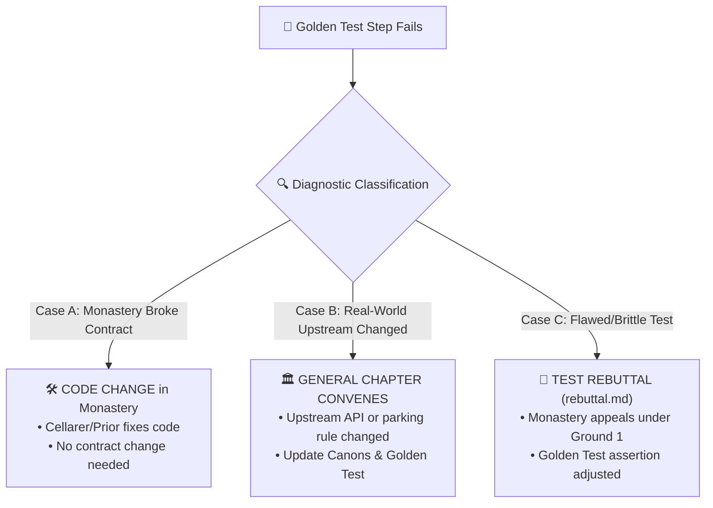

# Supreme Golden End-User Test (Abbas Primas)

**Version:** 1.0.0  
**Purpose:** End-to-end holistic verification of the entire Monastic Congregation from the perspective of a real Finnish sports family.

---

## 1. The Saturday Family Odyssey Scenario

The Supreme Golden Test does not test code trivia in isolation. It simulates a complete Saturday matchday for a family with multiple children active in Finnish sports:

1. **Family Profile:**
   * **Tuomas (age 11):** Plays Floorball (Salibandy) for Westend Indians Yellow at Otahalli Espoo.
   * **Aino (age 13):** Plays Football for HJK Sininen at Töölön Pallokenttä (Väiski).

2. **The 7 Golden Steps:**
   * **Step 1:** URL & Team Ingestion (`tulospalvelu.salibandy.fi/team/25301/info` and `tulospalvelu.palloliitto.fi/team/185085`).
   * **Step 2:** Sibling Schedule Conflict & Transit Buffer Calculation (Detects overlap at 15:00 vs 15:30 with 20 min transit buffer).
   * **Step 3:** Spatial Parking & Walking Gate Routing (Otahalli 4h disc vs Töölö Zone 2 payment).
   * **Step 4:** Floorball 3-Period Scoring & Special Teams (1–4, 1–5, 1–6 with YV%/AV% and Goalie Save %).
   * **Step 5:** Football Head-to-Head & Form Radar (Night Captain power bars and cards).
   * **Step 6:** 1-Tap Post-Match WhatsApp Share Report Generation.
   * **Step 7:** Autonomous AI Agent WebMCP Tool Discovery in `document.modelContext`.

---

## 2. Failure Diagnosis & Cross-Monastery Communication Protocol

When any step of the Supreme Golden Test fails, the system executes this diagnostic triage:

### Case A: Code Regression in a Monastery (Code Change Required)
* **Trigger:** A monastery refactored code and stopped emitting required fields defined in `contracts/index.ts`.
* **Action:** Master of Works / Cellarer of that specific monastery receives a blocker notice and must fix code before pushing.

### Case B: Upstream Real-World Change (Contract & Test Evolution Required)
* **Trigger:** Torneopal API changes schema or a city council modifies parking disc rules.
* **Action:** Legate convenes **The General Chapter** to evolve the Canons (`contracts/index.ts`) and update the Golden Test expectations.

### Case C: Flawed or Overly Brittle Test (Test Change Required)
* **Trigger:** Test fails on insignificant variance (e.g. 120m vs 125m walking distance).
* **Action:** Monastery appeals under `rebuttal.md` Ground 1 (Factually flawed assertion). Golden test assertions are tuned to acceptable ranges.
