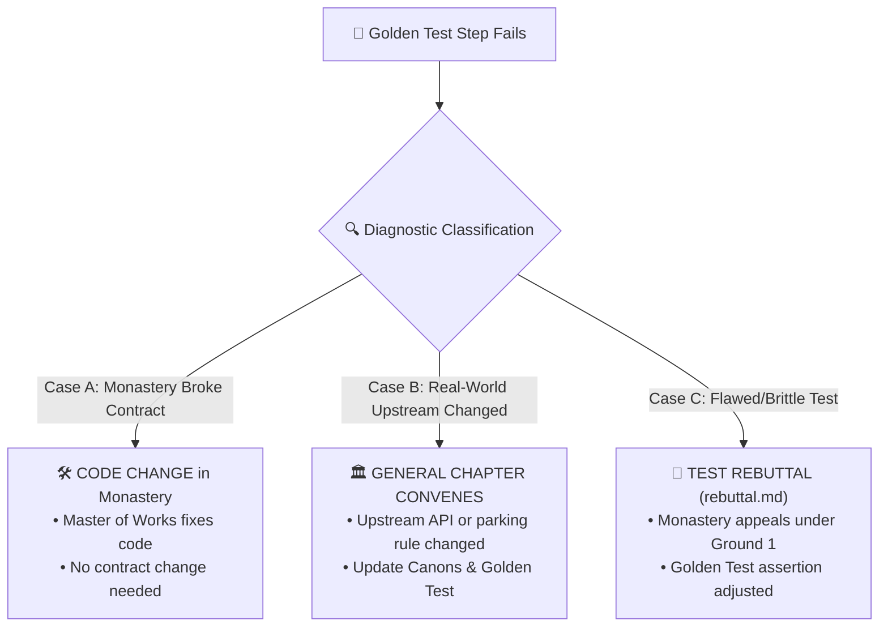

# 👑 Supreme Golden End-User Test (Abbas Primas)

**Version:** 1.1.0  
**Purpose:** End-to-end holistic verification of the entire Monastic Congregation from the perspective of a real Finnish sports family.  
**Standard:** Adheres strictly to the [5-Point Test Plan Specification](plans/TEST_PLAN_STANDARD.md).

---

## 1. The 5-Point Test Dimensions

Every step of the Supreme Golden Test fulfills the 5 mandatory dimensions:
1. **👤 User Journey:** The human-centric real-world Saturday story.
2. **🎯 Reason It Exists:** The concrete pain point and problem solved.
3. **🧪 What It Tests:** The exact interface contracts, schema invariants, and data flows.
4. **🟢 When It Succeeds:** The unambiguous pass condition.
5. **🔴 When It Should Fail:** The exact anomaly, threshold breach, or regression that must trigger a test failure.

See the complete matrix in [**`docs/plans/TEST_PLAN_STANDARD.md`**](plans/TEST_PLAN_STANDARD.md).

---

## 2. The 8 Golden Saturday Steps

| Step | Focus Area | What It Tests | Pass Condition | Fail Condition |
| :--- | :--- | :--- | :--- | :--- |
| **1. Team Ingestion** | SSBL, SPL, Basket.fi | `MatchdayContextContract` | Ingests 3 schedules with valid teams & dates | Expired API key (401/403) or missing times |
| **2. Conflict Engine** | Otahalli vs Töölö | Sibling overlap + driving buffer | Warns 2-driver conflict with 20m drive | 0-minute buffer or Null Island 14,758 min |
| **3. ParkkiS Routing** | Spatial Risk & Disc | `ParkingRiskContract` | 4h disc, risk 2/10, walking < 5 min | Risk outside 1-10 or walking > 1,500m |
| **4. Floorball Stats** | 3-Period Scoring | `FloorballStatsContract` | 3 periods sum to 15–3, goalie save % | Period sum mismatch or periods !== 3 |
| **5. Football H2H** | Night Captain Radar | `FootballStatsContract` | Form (W/D/L), power bars sum to 100% | Invalid form letters or division by zero |
| **6. Basketball Stats** | 4-Quarter & Fouls | `BasketballStatsContract` | 4 quarters sum to 68:62, bonus on 5 fouls | Quarters !== 4 or score sum mismatch |
| **7. WhatsApp Share** | 1-Tap Post-Match | Message formatting | Formatted text with goals, assists, saves | Output contains `undefined` or `NaN` |
| **8. WebMCP & Prod** | AI Tools & Live Edge | `document.modelContext` | All 6 Cloudflare URLs return HTTP 200 | Any URL 404/500 or X-Frame-Options DENY |

---

## 3. Failure Diagnosis & Cross-Monastery Communication Protocol

